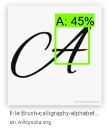

# EMNIST detection with fine-tuned Mobilenet_v2-SSD on Raspberry Pi 4
[](https://github.com/tensorflow/tensorflow/releases/tag/v2.5.0)
[](https://www.python.org/downloads/release/python-388/)
[](https://github.com/conda/conda/releases/tag/4.10.1)
[](https://www.raspberrypi.org/products/raspberry-pi-4-model-b/)

> This repository is forked from [tensorflow/models](https://github.com/tensorflow/models) and modified by [LIFOsitory](https://github.com/LIFOsitory)

### Appended and Modified Directories and Files
- custom_models
- model_zoo
- generate_dataset_old.py
- generate_dataset.py
- visualize_dataset.py
- generate_tfrecord.py
- generate_tflite.py
- infer_ckpt.py
- test_tflite.py
- detect_old.tflite

## Install Object Detection API with TensorFlow 2
> [Object Detection API with TensorFlow 2](research/object_detection/g3doc/tf2.md#installation)

### Python Package Installation

```bash
cd models/research
# Compile protos.
protoc object_detection/protos/*.proto --python_out=.
# Install TensorFlow
pip install tensorflow-gpu
# Install TensorFlow Object Detection API.
cp object_detection/packages/tf2/setup.py .
python -m pip install --use-feature=2020-resolver .
# Test the installation.
python object_detection/builders/model_builder_tf2_test.py
```

## Generate EMNIST letters Object Detection dataset


Dataset for object detection on EMNIST letters with COCO 2017 Background. By default, the script generates a dataset with the following attributes:

- 10,000 images in train. 1,000 images in test
- 26 Classes(A ~ Z)
- Between 1 and 5 letters per image
- Gaussian Blur

### Generate dataset


```bash
    python generate_dataset.py --data_dir="d:/tensorflow_dataset"
``` 

❗ COCO 2017을 사용하므로 다운로드 및 압축 해제 시간이 오래 걸립니다.(1~2시간)

❗ 파일의 용량이 매우 큽니다.

### Visualize dataset

The dataset can be visualized with the following command:

```bash
    python visualize_dataset.py
``` 

## Generate the TFRecord file
> [Preparing Inputs](research/object_detection/g3doc/using_your_own_dataset.md)

The dataset can be converted to TFRecord file with the following command: 

```bash
    python generate_tfrecord.py
```

## Train and Evaluate with TensorFlow 2
> [Training and evaluation guide (CPU, GPU, or TPU)](research/object_detection/g3doc/tf2_training_and_evaluation.md#Local)

### Training Command

A local training job can be run with the following command:

```bash
    python object_detection/model_main_tf2.py --pipeline_config_path="model_zoo/ssd_mobilenet_v2_320x320_coco17_tpu-8/pipeline.config" --model_dir="custom_models/ssd_mobilenet_v2_320x320_coco17_tpu-8" --alsologtostderr
```

### Evaluation Command

A local evaluation job can be run with the following command:

```bash
    python object_detection/model_main_tf2.py --pipeline_config_path="model_zoo/ssd_mobilenet_v2_320x320_coco17_tpu-8/pipeline.config" --model_dir="custom_models/ssd_mobilenet_v2_320x320_coco17_tpu-8" --checkpoint_dir="custom_models\ssd_mobilenet_v2_320x320_coco17_tpu-8" --alsologtostderr
```

### Running Tensorboard

Progress for training and eval jobs can be inspected using Tensorboard. If using the recommended directory structure, Tensorboard can be run using the following command:

```bash
    tensorboard --logdir="custom_models/ssd_mobilenet_v2_320x320_coco17_tpu-8"
```

### Run inference with checkpoint file
> [Run inference with models from the zoo](research/object_detection/colab_tutorials/inference_tf2_colab.ipynb)

```bash
    python infer_ckpt.py
```

## Run TF2 Models on Raspberry Pi
> [Running TF2 Detection API Models on mobile](research/object_detection/g3doc/running_on_mobile_tf2.md#step-1-export-tflite-inference-graph)

### Export TFLite inference grpah

An intermediate SavedModel that can be used with the TFLite Converter via commandline or Python API can be generated with the following command: 

```bash
    python object_detection/export_tflite_graph_tf2.py --pipeline_config_path "model_zoo/ssd_mobilenet_v2_320x320_coco17_tpu-8/pipeline.config" --trained_checkpoint_dir "custom_models\ssd_mobilenet_v2_320x320_coco17_tpu-8" --output_directory "custom_models/ssd_mobilenet_v2_320x320_coco17_tpu-8"
```

### Convert to TFLite

The SavedModel can be converted to TFLite with the following command: 

```bash
    python generate_tflite.py
```

You can infer the TFLite file with the following command:

```bash
    python test_tflite.py
```

### Run TFLite Model on Raspberry Pi 4

#### C++

[Pi image installation instructions](https://github.com/Qengineering/TensorFlow_Lite_SSD_RPi_64-bits)

#### Python

[TensorFlow Lite Python object detection example with Pi Camera](https://github.com/tensorflow/examples/tree/master/lite/examples/object_detection/raspberry_pi)

## Legacy
- generate_dataset_old.py
```bash
    python generate_dataset_old.py --data_dir="d:/tensorflow_dataset"
```


고정된 크기 300 x 300, A ~ D 만 사용하여 Dataset 생성

- model_zoo/ssd_mobilenet_v2_320x320_coco17_tpu-8/pipeline_old.config

A ~ D 만 사용하는 config 파일

- custom_models/ssd_mobilenet_v2_320x320_coco17_tpu-8_old

A ~ D 만을 학습한 ckpt 파일  (step 50000)

- detect_old.tflite

A ~ D 만 탐지하는 tflite 파일

- Evaluation Sample


- 일반적인 글자 이미지에 대해서 학습하지 않아 구글 이미지에 대해서는 성능이 좋지 못함.
 


## Reference
- [Training and Evaluation with TensorFlow 2](https://github.com/tensorflow/models/blob/master/research/object_detection/g3doc/tf2_training_and_evaluation.md)
- [MNIST Object Detection dataset](https://github.com/hukkelas/MNIST-ObjectDetection)
- [2.1. Custom Dataset으로 TFRecord 파일 만들기](https://ballentain.tistory.com/48)
- [How to Create to a TFRecord File for Computer Vision and Object Detection](https://blog.roboflow.com/create-tfrecord/)
- [Install 64 bit OS on Raspberry Pi 4 + USB boot](https://qengineering.eu/install-raspberry-64-os.html)
- [TensorFlow Datasets, A collection of ready-to-use datasets](https://www.tensorflow.org/datasets/overview)
- Cohen, G., Afshar, S., Tapson, J., & Van Schaik, A. (2017, May). EMNIST: Extending MNIST to handwritten letters. In 2017 International Joint Conference on Neural Networks (IJCNN) (pp. 2921-2926). IEEE.
- Sandler, M., Howard, A., Zhu, M., Zhmoginov, A., & Chen, L. C. (2018). Mobilenetv2: Inverted residuals and linear bottlenecks. In Proceedings of the IEEE conference on computer vision and pattern recognition (pp. 4510-4520).
- Liu, W., Anguelov, D., Erhan, D., Szegedy, C., Reed, S., Fu, C. Y., & Berg, A. C. (2016, October). Ssd: Single shot multibox detector. In European conference on computer vision (pp. 21-37). Springer, Cham.